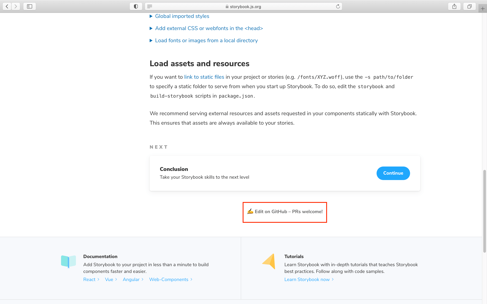
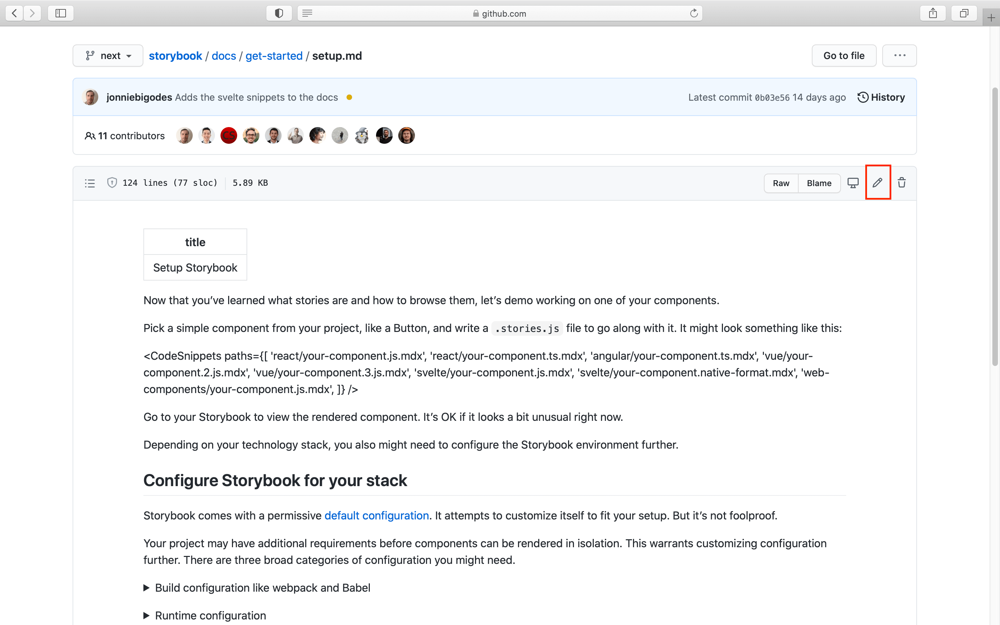
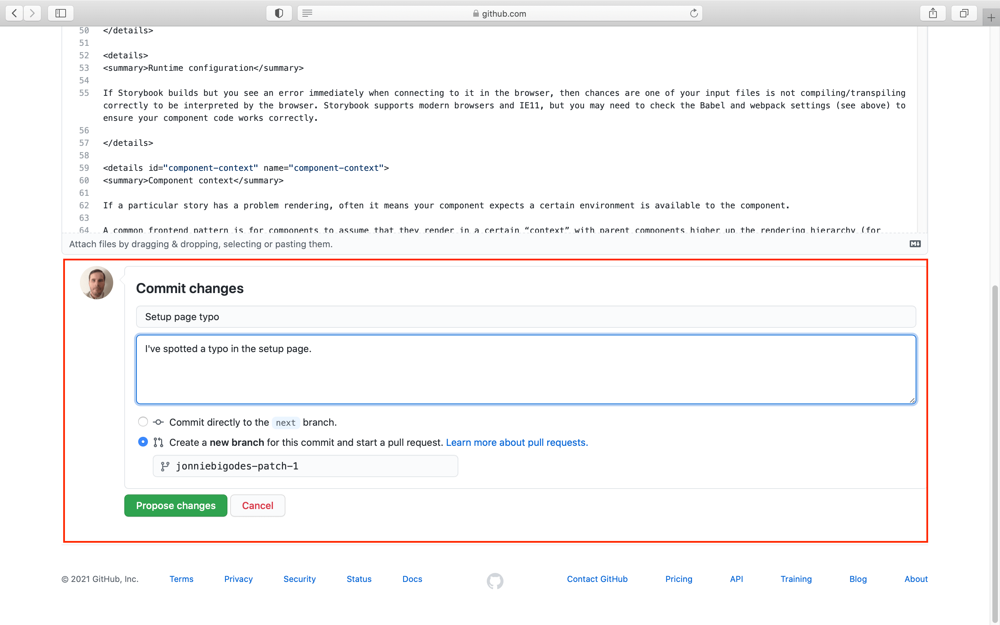

Contributions to the documentation are welcome and strongly encouraged. Either by fixing a small typo or a semantic error. This page outlines how to get involved and contribute to [Storybook's](https://github.com/storybookjs/storybook) documentation. For instructions on working with the codebase, check the [code contributions](./code.md) page, and for code snippets, check the [code snippets](./new-snippets.md) page.

## Identify and fix documentation issues

While browsing our documentation, you encounter an issue with the documentation, either a small typo or a semantic error; we encourage you to help us fix it. 

Start by scrolling to the bottom of the page in question, then click ✍️ Edit on GitHub – PRs welcome!

Click the pencil icon on the right-hand corner to edit the document and apply your fix.

Scroll down to the bottom of the page, fill the form with clear and concise information. 

Next, select the `Create a new branch for this commit and start a pull request` option and finally, click the `Propose changes` button.

## Create the pull request

In the Storybook repository, fill the form with the necessary information, and submit your pull request. One of the maintainers will guide you through the triage and merge process.