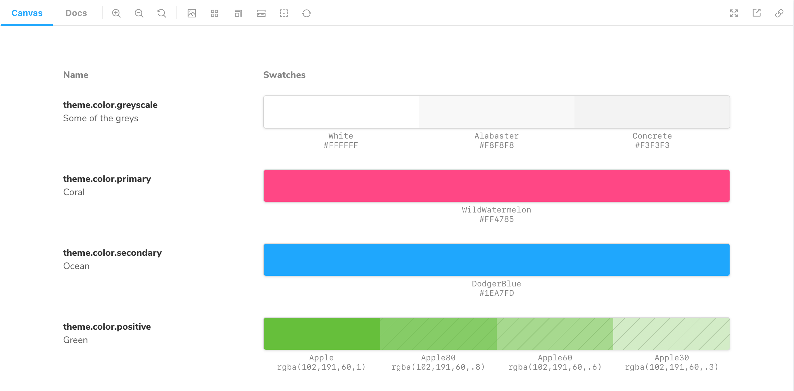

Storybook's `ColorPalette` Doc block allows you to document all color-related items (e.g., swatches) used throughout your project.

## Working with MDX

Similar to [`Typeset`](./doc-block-typeset.md), the `ColorPalette` Doc Block is also typically used with MDX. It supports additional customization via options. Below are some examples and a table with all the available options.

<!-- prettier-ignore-start -->

<CodeSnippets
  paths={[
    'common/colorpalette-doc-block.starter-example.mdx.mdx',
    'common/colopalette-doc-block.advanced-example.mdx.mdx',
  ]}
/>

<!-- prettier-ignore-end -->

| Option     | Description                                                                                                          |
| ---------- | -------------------------------------------------------------------------------------------------------------------- |
| `title`    | Sets the name of the color to be displayed.   `<ColorItem title='tomato' />`                                     |
| `subtitle` | Provides an additional description to the color.   `<ColorItem subtitle='This is a bright red color' />`         |
| `colors`   | Provides the list of colors to be displayed.   `<ColorItem colors={{ White: '#FFFFFF', Concrete: '#F3F3F3' } />` |