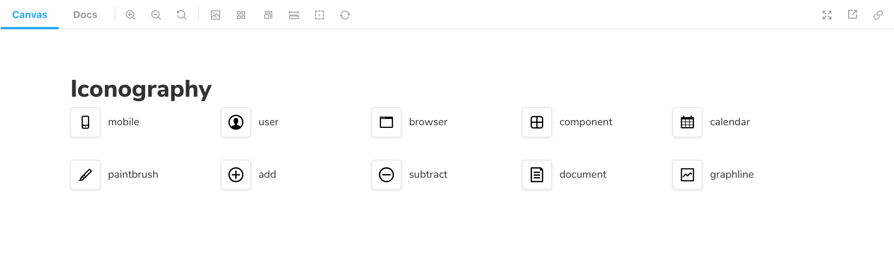

Storybook's `IconGallery` Doc Block enables you easily document all icons associated with your project.

## Working with MDX

Similar to other documentation-oriented Doc Blocks such as [`TypeSet`](./doc-block-typeset.md), or [`ColorPallete`](./doc-block-colorpalette.md), the `IconGallery` is also typically used with MDX. It allows you to provide additional customization via options. Below is a condensed example and table featuring all the available options.

<!-- prettier-ignore-start -->

<CodeSnippets
  paths={[
    'common/icongallery-doc-block.mdx.mdx',
  ]}
/>

<!-- prettier-ignore-end -->

| Option | Description                                               |
| ------ | --------------------------------------------------------- |
| `name` | Sets the name of the icon.   `<IconItem name="add"/>` |