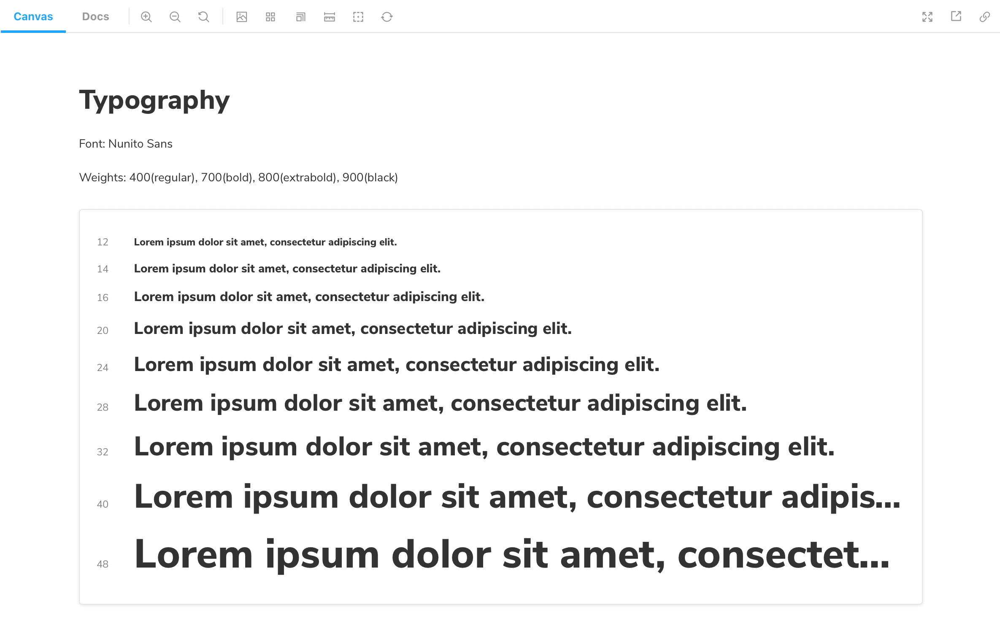

Storybook's `Typeset` Doc Block helps document the fonts used throughout your project.

## Working with MDX

Similar to other documentation related Doc Blocks (e.g., `ColorPalette`, `IconGallery`), the `TypeSet` Doc Block is also commonly used with MDX. It allows additional customization via options. Below is a condensed example and table featuring all the available options.

<!-- prettier-ignore-start -->

<CodeSnippets
  paths={[
    'common/typeset-doc.block.mdx.mdx',
  ]}
/>

<!-- prettier-ignore-end -->

| Option       | Description                                                                             |
| ------------ | --------------------------------------------------------------------------------------- |
| `fontFamily` | Provides a font family to be displayed .   `<Typeset fontFamily={"Nunito Sans"} />` |
| `fontSizes`  | Provides a list of available font sizes.   `<Typeset fontSizes={[ 12, 14, 20 ]} />` |
| `fontWeight` | Defines the weight of the font to be displayed.   `<Typeset fontWeight={800} />`    |
| `sampleText` | Defines the text to be displayed.   `<Typeset sampleText='Example Text' />`         |