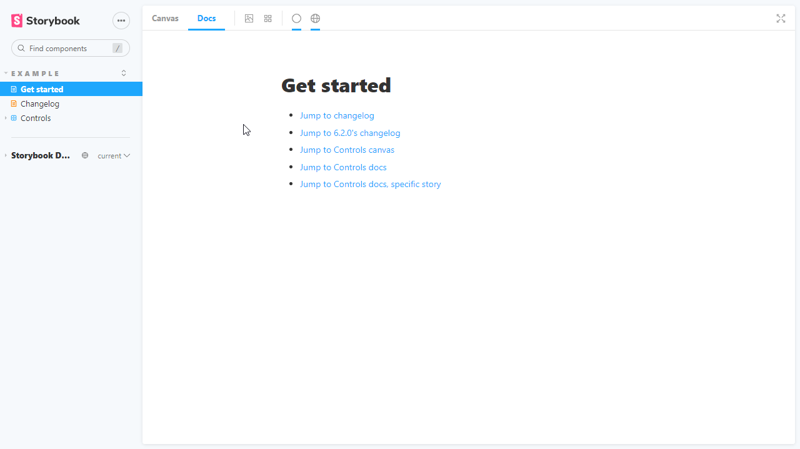

<div class="aside">

💡 Currently there's an issue when using MDX stories with IE11. This issue does <strong>not</strong> apply to [Docs page](./docs-page.md). If you're interested in helping us fix this issue, read our <a href="https://github.com/storybookjs/storybook/blob/next/CONTRIBUTING.md">Contribution guidelines</a> and submit a pull request.

</div>

MDX is a [standard file format](https://mdxjs.com/) that combines Markdown with JSX. It means you can use Markdown’s terse syntax (such as # heading) for your documentation, write stories that compile to our component story format, and freely embed JSX component blocks at any point in the file. All at once.

In addition, you can write pure documentation pages in MDX and add them to Storybook alongside your stories.


## Basic example

Let's get started with an example that combines Markdown with a single story:

<!-- prettier-ignore-start -->

<CodeSnippets
  paths={[
    'react/checkbox-story.mdx.mdx',
    'angular/checkbox-story.mdx.mdx',
    'vue/checkbox-story.mdx-2.mdx.mdx',
    'vue/checkbox-story.mdx-3.mdx.mdx',
    'svelte/checkbox-story.mdx.mdx',
  ]}
/>

<!-- prettier-ignore-end -->

And here's how that's rendered in Storybook:


As you can see, a lot is going on here. We're writing Markdown, we're writing JSX, and we're also defining Storybook stories that are drop-in compatible with the entire Storybook ecosystem.

Let's break it down.

## MDX-flavored CSF

MDX-flavored [Component Story Format (CSF)](../api/csf.md) includes a collection of components called ["Doc Blocks"](./doc-blocks.md), that allow Storybook to translate MDX files into Storybook stories. MDX-defined stories are identical to regular Storybook stories, so they can be used with Storybook's entire ecosystem of addons and view layers.

For example, here's the first story from the Checkbox example above, rewritten in CSF:

<!-- prettier-ignore-start -->

<CodeSnippets
  paths={[
    'common/checkbox-story-csf.js.mdx',
  ]}
/>

<!-- prettier-ignore-end -->

There's a one-to-one mapping from the code in MDX to CSF. As a user, this means your existing Storybook knowledge should translate between the two.

## Writing stories

Let's look at a more realistic example to see how MDX works:

<!-- prettier-ignore-start -->

<CodeSnippets
  paths={[
    'react/badge-story.mdx.mdx',
    'angular/badge-story.mdx.mdx',
    'vue/badge-story.mdx-2.mdx.mdx',
    'vue/badge-story.mdx-3.mdx.mdx',
    'svelte/badge-story.mdx.mdx',
  ]}
/>

<!-- prettier-ignore-end -->

And here's how that gets rendered in Storybook:


## Customizing ArgTypes with MDX

As already mentioned [above](#mdx-flavored-csf), there's a one-to-one mapping between MDX and CSF.

Based on this principle, if the Badge story included the following `ArgTypes`:

<!-- prettier-ignore-start -->

<CodeSnippets
  paths={[
    'common/badge-story-custom-argtypes.js.mdx',
  ]}
/>

<!-- prettier-ignore-end -->

Transitioning them into MDX format is relatively seamless and would only require the following change to the story:

<!-- prettier-ignore-start -->

<CodeSnippets
  paths={[
    'common/badge-story-custom-argtypes.mdx.mdx',
  ]}
/>

<!-- prettier-ignore-end -->

And here's how that gets rendered in Storybook:

<video autoPlay muted playsInline loop>
  <source
    src="custom-argTypes-mdx-optimized.mp4"
    type="video/mp4"
  />
</video>

<div class="aside">

If you find yourself with a considerably sized <code>argTypes</code> implementation. You can extract them into a variable and pass them as a prop.

</div>

## Embedding stories

Suppose you have an existing story and want to embed it into your docs. Here's how to show a story with ID some--id. Check the browser URL in Storybook v5+ to find a story's ID.

<!-- prettier-ignore-start -->

<CodeSnippets
  paths={[
    'common/component-story-mdx-embed.mdx.mdx',
  ]}
/>

<!-- prettier-ignore-end -->

You can also use the rest of the MDX features in conjunction with embedding. That includes source, preview, and prop tables.

## Decorators and parameters

To add decorators and parameters in MDX:

<!-- prettier-ignore-start -->

<CodeSnippets
  paths={[
    'common/component-story-mdx-decorators-params.mdx.mdx',
  ]}
/>

<!-- prettier-ignore-end -->

Global parameters and decorators work just like before.

## Documentation-only MDX

Typically, when you use Storybook MDX, you define stories in the MDX, and documentation is automatically associated with those stories. But what if you want to write Markdown-style documentation without any stories inside?

Suppose you don't define stories in your MDX. In that case, you can write MDX documentation and associate it with an existing story or embed that MDX as its own documentation node in your Storybook's navigation.

If you don't define a Meta, you can write Markdown and associate with an existing story. See ["CSF Stories with MDX Docs"](../../addons/docs/docs/recipes.md#csf-stories-with-mdx-docs).

To get a "documentation-only story" in your UI, define a `<Meta>` as you normally would, but don't define any stories. It will show up in your UI as a documentation node:


### Syntax highlighting

When writing your documentation with Storybook and MDX, you get syntax highlighting out of the box for a handful of popular languages (Javascript, Markdown, CSS, HTML, Typescript, GraphQL). For other formats, for instance, SCSS, you'll need to extend the syntax highlighter manually:

<!-- prettier-ignore-start -->

<CodeSnippets
  paths={[
   'common/my-component-with-custom-syntax-highlight.mdx.mdx',
  ]}
/>

<!-- prettier-ignore-end -->

<div class="aside">
💡 For a list of available languages, check <code>react-syntax-highlighter</code>'s <a href="https://github.com/react-syntax-highlighter/react-syntax-highlighter">documentation</a>.
</div>

Once you've updated your documentation, you'll see the code block properly highlighted. You can also apply the same principle to other unsupported formats (i.e., `diff`, `hbs`).

## Linking to other stories and pages

When writing MDX, you may want to provide links to other stories or documentation pages and sections. You can use the `path` query string.

Considering a story with ID `some--id`, this redirects to the **Docs** tab of the story:

```md
[Go to specific documentation page](?path=/docs/some--id)
```

This redirects to the **Canvas** tab of the story:

```md
[Go to specific story canvas](?path=/story/some--id)
```

You can also use anchors to target a specific section of a page:

```md
[Go to the conclusion of the documentation page](?path=/docs/some--id#conclusion)
```

<div class="aside">
💡 By applying this pattern with the Controls addon, all anchors will be ignored in Canvas based on how Storybook handles URLs to track the args values.
</div>



## MDX file names

Unless you use a custom [webpack configuration](../configure/webpack.md#extending-storybooks-webpack-config), all of your MDX files should have the suffix `*.stories.mdx`. This tells Storybook to apply its special processing to the `<Meta>` and `<Story>` elements in the file.

<div class="aside">

Be sure to update [.storybook/main.js](../configure/overview.md#configure-story-rendering) file to load `.stories.mdx` stories, as per the addon-docs installation instructions.

</div>