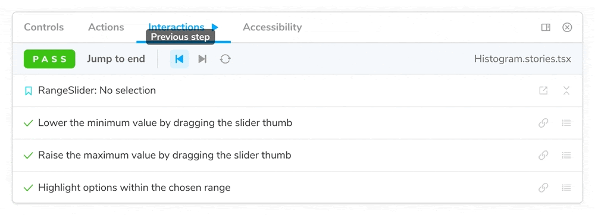

`Play` functions are small snippets of code executed after the story renders. Enabling you to interact with your components and test scenarios that otherwise required user intervention.

## Setup the interactions addon

We recommend installing Storybook's `addon-interactions` before you start writing stories with the `play` function. It's the perfect complement for it, including a handy set of UI controls to allow you command over the execution flow. At any time, you can pause, resume, rewind, and step through each interaction. Also providing you with an easy-to-use debugger for potential issues.

Run the following command to install the addon.

```shell
# With npm
npm install @storybook/addon-interactions --save-dev

# With yarn
yarn add --dev @storybook/addon-interactions
```

Update your Storybook configuration (in `.storybook/main.js`) to include the interactions addon.

<!-- prettier-ignore-start -->

<CodeSnippets
  paths={[
   'common/storybook-addon-interaction-registration.js.mdx',
  ]}
/>

<!-- prettier-ignore-end -->



<div class="aside">
TODO: Placeholder video. It needs a new one once the addon is released.
</div>

## Writing stories with the play function

Storybook's `play` functions are small code snippets that run once the story finishes rendering. Aided by the `addon-interactions`, it allows you to build component interactions and test scenarios that were impossible without user intervention. For example, if you were working on a registration form and wanted to validate it, you could write the following story with the `play` function:

<!-- prettier-ignore-start -->

<CodeSnippets
  paths={[
   'react/register-component-with-play-function.js.mdx',
   'react/register-component-with-play-function.mdx.mdx',
   'angular/register-component-with-play-function.ts.mdx',
   'angular/register-component-with-play-function.mdx.mdx',
   'vue/register-component-with-play-function.js.mdx',
   'vue/register-component-with-play-function.mdx.mdx',
   'svelte/register-component-with-play-function.js.mdx',
   'svelte/register-component-with-play-function.mdx.mdx',
  ]}
/>

<!-- prettier-ignore-end -->

When Storybook finishes rendering the story, it executes the steps defined within the `play` function, interacting with the component and filling the form's information. All of this without the need for user intervention. If you check your `Interactions` panel, you'll see the step-by-step flow.

## Composing stories

Thanks to the [Component Story Format](../api/csf.md), an ES6 module based file format, you can also combine your `play` functions, similar to other existing Storybook features (e.g., [args](./args.md)). For example, if you wanted to verify a specific workflow for your component, you could write the following stories:

<!-- prettier-ignore-start -->

<CodeSnippets
  paths={[
   'react/my-component-play-function-composition.js.mdx',
   'angular/my-component-play-function-composition.ts.mdx',
   'vue/my-component-play-function-composition.js.mdx',
   'svelte/my-component-play-function-composition.js.mdx',
  ]}
/>

<!-- prettier-ignore-end -->

By combining the stories, you're recreating the entire component workflow and spot potential issues while reducing the boilerplate code you need to write.

## Delaying interactions

Assuming that you're working with a component with validation logic implemented (e.g., email validation, password strength). In that case, you can introduce delays within your `play` function to emulate user interaction and assert if the values provided are valid or not. For example:

<!-- prettier-ignore-start -->

<CodeSnippets
  paths={[
   'react/my-component-play-function-with-delay.js.mdx',
   'react/my-component-play-function-with-delay.mdx.mdx',
   'angular/my-component-play-function-with-delay.ts.mdx',
   'angular/my-component-play-function-with-delay.mdx.mdx',
   'vue/my-component-play-function-with-delay.js.mdx',
   'vue/my-component-play-function-with-delay.mdx.mdx',
   'svelte/my-component-play-function-with-delay.js.mdx',
   'svelte/my-component-play-function-with-delay.mdx.mdx',
  ]}
/>

<!-- prettier-ignore-end -->

When Storybook loads the story, it interacts with the component, filling in its inputs and triggering any validation logic defined.

## Working with events

Most modern UIs are built focusing on interaction (e.g., button clicks, selecting options, ticking checkboxes), providing rich experiences to the end-user. With the `play` function, you can incorporate the same level of interaction into your stories.

The most common scenario for component interaction is a button click. If you need to reproduce it in your story, you can adjust your story's `play` function to the following:

<!-- prettier-ignore-start -->

<CodeSnippets
  paths={[
   'react/my-component-play-function-with-clickevent.js.mdx',
   'react/my-component-play-function-with-clickevent.mdx.mdx',
   'angular/my-component-play-function-with-clickevent.ts.mdx',
   'angular/my-component-play-function-with-clickevent.mdx.mdx',
   'vue/my-component-play-function-with-clickevent.js.mdx',
   'vue/my-component-play-function-with-clickevent.mdx.mdx',
   'svelte/my-component-play-function-with-clickevent.js.mdx',
   'svelte/my-component-play-function-with-clickevent.mdx.mdx',
  ]}
/>

<!-- prettier-ignore-end -->

When Storybook loads the story and the function executes, it interacts with the component and triggers the button click, similar to what a user would do.

Asides from click events, you can also script additional events with the `play` function. For example, if your component includes a dropdown with various options, you can write the following story and test each scenario:

<!-- prettier-ignore-start -->

<CodeSnippets
  paths={[
   'react/my-component-play-function-with-selectevent.js.mdx',
   'react/my-component-play-function-with-selectevent.mdx.mdx',
   'angular/my-component-play-function-with-selectevent.ts.mdx',
   'angular/my-component-play-function-with-selectevent.mdx.mdx',
   'vue/my-component-play-function-with-selectevent.js.mdx',
   'vue/my-component-play-function-with-selectevent.mdx.mdx',
   'svelte/my-component-play-function-with-selectevent.js.mdx',
   'svelte/my-component-play-function-with-selectevent.mdx.mdx',
  ]}
/>

<!-- prettier-ignore-end -->

## Querying elements

If you need, you can also adjust your `play` function to interact with your component based on different parameters (e.g., role, text content). For example:

<!-- prettier-ignore-start -->

<CodeSnippets
  paths={[
   'react/my-component-play-function-alt-queries.js.mdx',
   'react/my-component-play-function-alt-queries.mdx.mdx',
   'angular/my-component-play-function-alt-queries.ts.mdx',
   'angular/my-component-play-function-alt-queries.mdx.mdx',
   'vue/my-component-play-function-alt-queries.js.mdx',
   'vue/my-component-play-function-alt-queries.mdx.mdx',
   'svelte/my-component-play-function-alt-queries.js.mdx',
   'svelte/my-component-play-function-alt-queries.mdx.mdx',
  ]}
/>

<!-- prettier-ignore-end -->

## Working with the Canvas

With each interaction you write inside your `play` function when Storybook executes it, it starts from the top-level element of the Canvas, acceptable for smaller components (e.g., buttons, checkboxes, text inputs). For complex components (e.g., forms, pages), we recommend that you adjust your stories and start from the component's root, for example:

<!-- prettier-ignore-start -->

<CodeSnippets
  paths={[
   'react/my-component-play-function-with-canvas.js.mdx',
   'react/my-component-play-function-with-canvas.mdx.mdx',
   'angular/my-component-play-function-with-canvas.ts.mdx',
   'angular/my-component-play-function-with-canvas.mdx.mdx',
   'vue/my-component-play-function-with-canvas.js.mdx',
   'vue/my-component-play-function-with-canvas.mdx.mdx',
    'svelte/my-component-play-function-with-canvas.js.mdx',
   'svelte/my-component-play-function-with-canvas.mdx.mdx',
  ]}
/>

<!-- prettier-ignore-end -->

Applying these changes into your stories, you'll get a performance boost and improved error handling with the `addon-interactions`.
