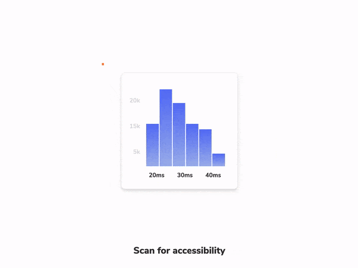
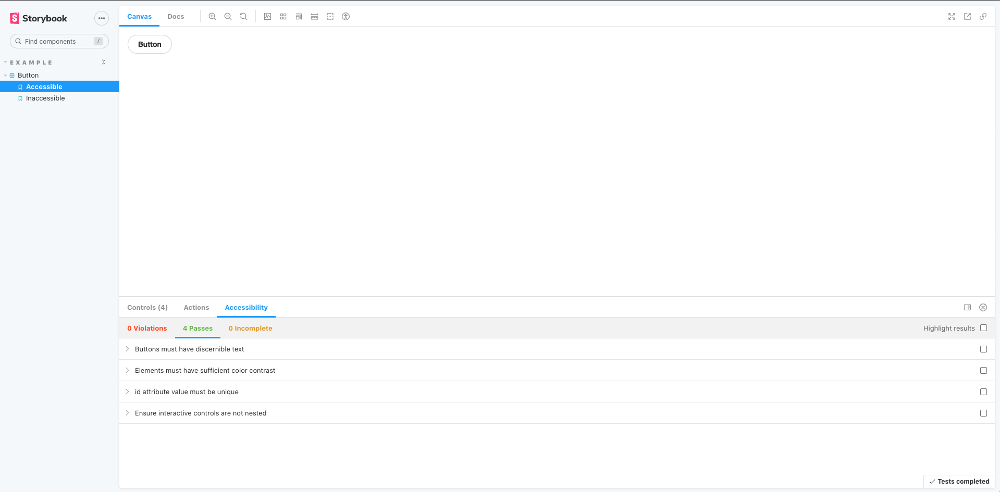
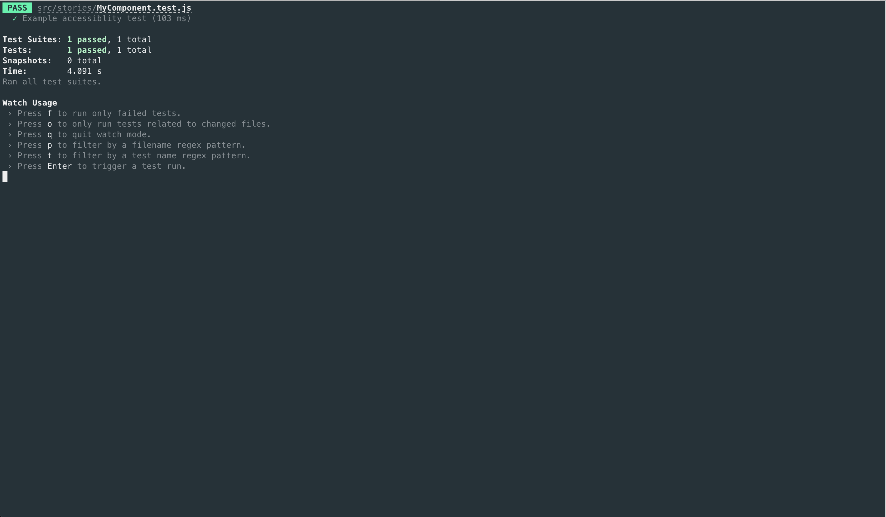

Accessibility is the practice of making websites inclusive to all. That means supporting requirements such as: keyboard navigation, screen reader support, touch-friendly, usable color contrast, reduced motion, and zoom support.

Accessibility tests audit the rendered DOM against a set of heuristics based on [WCAG](https://www.w3.org/WAI/standards-guidelines/wcag/) rules and other industry-accepted best practices. They act as the first line of QA to catch blatant accessibility violations.

Storybook’s official [a11y addon](https://storybook.js.org/addons/@storybook/addon-a11y) runs accessibility audits while you’re developing components to give you a fast feedback loop. It's powered by Deque's [axe-core](https://github.com/dequelabs/axe-core), which automatically catches up to [57% of WCAG issues](https://www.deque.com/blog/automated-testing-study-identifies-57-percent-of-digital-accessibility-issues/).



## Setup a11y addon

To enable accessibility testing with Storybook, you'll need to install the [`@storybook/addon-a11y`](https://storybook.js.org/addons/@storybook/addon-a11y/) addon. Run the following command:

```shell
# With npm
npm install @storybook/addon-a11y --save-dev

# With yarn
yarn add --dev @storybook/addon-a11y
```

Update your Storybook configuration (in `.storybook/main.js`) to include the accessibility addon:

<!-- prettier-ignore-start -->

<CodeSnippets
  paths={[
    'common/storybook-a11y-register.js.mdx',
  ]}
/>

<!-- prettier-ignore-end -->

Start your Storybook, and you will see some noticeable differences in the UI. A new toolbar icon and the accessibility panel where you can inspect the results of the tests.

<video autoPlay muted playsInline loop>
  <source
    src="storybook-a11y-starter-setup-optimized.mp4"
    type="video/mp4"
  />
</video>

### How it works

Storybook's a11y addon runs [Axe](https://github.com/dequelabs/axe-core) on the selected story. Allowing you to catch and fix accessibility issues during development. For example, if you’re working on a button component and included the following set of stories:

<!-- prettier-ignore-start -->

<CodeSnippets
  paths={[
    'react/component-story-with-accessibility.js.mdx',
    'react/component-story-with-accessibility.ts.mdx',
    'react/component-story-with-accessibility.mdx.mdx',
    'angular/component-story-with-accessibility.ts.mdx',
    'angular/component-story-with-accessibility.mdx.mdx',
    'vue/component-story-with-accessibility.2.js.mdx',
    'vue/component-story-with-accessibility.mdx-2.mdx.mdx',
    'vue/component-story-with-accessibility.3.js.mdx',
    'vue/component-story-with-accessibility.mdx-3.mdx.mdx',
    'svelte/component-story-with-accessibility.js.mdx',
    'svelte/component-story-with-accessibility.mdx.mdx',
  ]}
/>

<!-- prettier-ignore-end -->

Cycling through both stories, you will see that the `Inaccessible` story contains some issues that need fixing. Opening the violations tab in the accessibility panel provides a clear description of the accessibility issue and guidelines for solving it.



### Configure

Out of the box, Storybook's accessibility addon includes a set of accessibility rules that cover most issues. You can also fine tune the [addon configuration](https://github.com/storybookjs/storybook/tree/next/addons/a11y#parameters) or override [Axe's ruleset](https://github.com/storybookjs/storybook/tree/next/addons/a11y#handling-failing-rules) to best suit your needs.

#### Global a11y configuration

If you need to dismiss an accessibility rule or modify its settings across all stories, you can add the following to your [storybook/preview.js](../configure/overview.md#configure-story-rendering):

<!-- prettier-ignore-start -->

<CodeSnippets
  paths={[
    'common/storybook-addon-a11y-global-config.js.mdx',
  ]}
/>

<!-- prettier-ignore-end -->

#### Component-level a11y configuration

You can also customize your own set of rules for all stories of a component. Update your story's default export and add a parameter with the required configuration:

<!-- prettier-ignore-start -->

<CodeSnippets
  paths={[
    'common/storybook-addon-a11y-component-config.js.mdx',
    'common/storybook-addon-a11y-component-config.mdx.mdx',
  ]}
/>

<!-- prettier-ignore-end -->

#### Story-level a11y configuration

Customize the a11y ruleset at the story level by updating your story to include a new parameter:

<!-- prettier-ignore-start -->

<CodeSnippets
  paths={[
    'react/storybook-addon-a11y-story-config.js.mdx',
    'react/storybook-addon-a11y-story-config.ts.mdx',
    'react/storybook-addon-a11y-story-config.mdx.mdx',
    'angular/storybook-addon-a11y-story-config.ts.mdx',
    'angular/storybook-addon-a11y-story-config.mdx.mdx',
    'vue/storybook-addon-a11y-story-config.js.mdx',
    'vue/storybook-addon-a11y-story-config.mdx.mdx',
    'svelte/storybook-addon-a11y-story-config.js.mdx',
    'svelte/storybook-addon-a11y-story-config.mdx.mdx',
  ]}
/>

<!-- prettier-ignore-end -->

#### How to disable a11y tests

Disable accessibility testing for stories or components by adding the following parameter to your story’s export or component’s default export respectively:

<!-- prettier-ignore-start -->

<CodeSnippets
  paths={[
   'react/storybook-addon-a11y-disable.js.mdx',
   'react/storybook-addon-a11y-disable.ts.mdx',
   'react/storybook-addon-a11y-disable.mdx.mdx',
   'angular/storybook-addon-a11y-disable.ts.mdx',
   'angular/storybook-addon-a11y-disable.mdx.mdx',
   'vue/storybook-addon-a11y-disable.js.mdx',
   'vue/storybook-addon-a11y-disable.mdx.mdx',
   'svelte/storybook-addon-a11y-disable.js.mdx',
   'svelte/storybook-addon-a11y-disable.mdx.mdx',
  ]}
/>

<!-- prettier-ignore-end -->

## Automate accessibility tests with Jest

Accessibility testing with Storybook shortens the feedback loop which means you fix issues faster. Reuse stories in a Jest test and run an accessibility audit on them using the the [jest-axe integration](https://github.com/nickcolley/jest-axe). That also unlocks the ability to integrate accessibility tests into your functional testing pipeline.

For example, include the following test file to run an accessibility test on a story:

<!-- prettier-ignore-start -->

<CodeSnippets
  paths={[
    'react/accessibility-testing-with-jest-axe.js.mdx',
    'vue/accessibility-testing-with-jest-axe.js.mdx',
  ]}
/>

<!-- prettier-ignore-end -->

When you execute your test script, it will run the accessibility audit along with any interaction tests you might have.



---

#### What’s the difference between browser-based and linter-based accessibility tests?

Browser-based accessibility tests, like found in Storybook, evaluates the rendered DOM because that gives you the highest accuracy. Auditing code that hasn't been compiled yet is one step removed from the real thing so you won't catch everything the user might experience.

#### Learn about other UI tests

- [Visual tests](./visual-testing.md) for appearance
- Accessibility tests for accessibility
- [Interaction tests](./interaction-testing.md) for user behavior simulation
- [Snapshot tests](./snapshot-testing.md) for rendering errors and warnings
- [Import stories in other tests](./importing-stories-in-tests.md) for other tools
