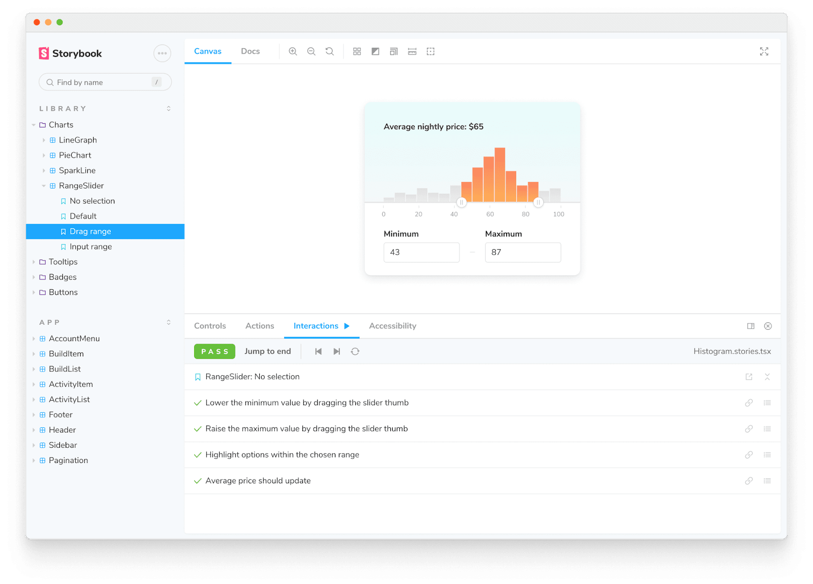
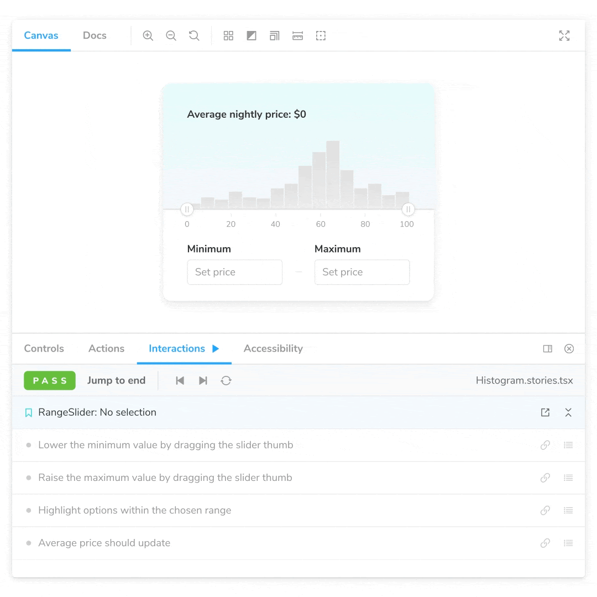

As you build more complex UIs like pages, components become responsible for more than just rendering the UI. They fetch data and manage state. Interaction tests allow you to verify these functional aspects of UI.

In a nutshell, you start by supplying the appropriate props for the initial state of a component. Then simulate user behavior such as clicks and form entries. Finally, test expectations to check whether the UI and component state update correctly.

## Setup interactions addon

You can set up interaction testing in Storybook using the `play` function and [`@storybook/addon-interactions`](https://storybook.js.org/addons/@storybook/addon-interactions/).

- `play` function is a convenient helper method to help test use cases that would otherwise require manual interaction from a user. They are small snippets of code that run after the story finishes rendering.

- `@storybook/addon-interactions` includes helper utilities and a playback interface that simulates user behavior in the browser. It’s powered Testing Library and includes convenient instrumentation for debugging.

Here's an example of how to set up interaction testing in Storybook with the `play` function:

<!-- prettier-ignore-start -->

<CodeSnippets
  paths={[
    'common/login-form-with-play-function.js.mdx',
  ]}
/>

<!-- prettier-ignore-end -->

Once the story loads in the UI, it simulates the user's behavior and verifies the underlying logic.

<video autoPlay muted playsInline loop>
  <source
    src="addon-interaction-example-optimized.mp4"
    type="video/mp4"
  />
</video>

## API for user-events

Under the hood, Storybook’s interaction addon mirrors Testing Library’s `user-events` API. If you’re familiar with [Testing Library](https://testing-library.com/) you should be at home in Storybook.

Below is an abridged API for user-event. For more, check out the [official user-event docs](https://testing-library.com/docs/ecosystem-user-event/).

| User events     | Description                                                      | Example                                                                                |
| --------------- | ---------------------------------------------------------------- | -------------------------------------------------------------------------------------- |
| clear           | Selects the text inside inputs, or textareas and deletes it      | `userEvent.clear(await within(canvasElement).getByRole('myinput'));`                   |
| click           | Clicks the element, calling a click() function                   | `userEvent.click(await within(canvasElement).getByText('mycheckbox'));`                |
| dblClick        | Clicks the element twice                                         | `userEvent.dblClick(await within(canvasElement).getByText('mycheckbox'));`             |
| deselectOptions | Removes the selection from a specific option of a select element | `userEvent.deselectOptions(await within(canvasElement).getByRole('listbox','1'));`     |
| hover           | Hovers an element                                                | `userEvent.hover(await within(canvasElement).getByTestId('example-test'));`            |
| keyboard        | Simulates the keyboard events                                    | `userEvent.keyboard(‘foo’);`                                                           |
| selectOptions   | Selects the specified option, or options of a select element     | `userEvent.selectOptions(await within(canvasElement).getByRole('listbox'),['1','2']);` |
| type            | Writes text inside inputs, or textareas                          | `userEvent.type(await within(canvasElement).getByRole('my-input'),'Some text');`       |
| unhover         | Unhovers out of element                                          | `userEvent.unhover(await within(canvasElement).getByLabelText(/Example/i));`           |

## Running tests

In addition to interacting with the component using the `play` function, you can also write assertions to verify behavior. That offers a complete testing workflow without additional packages or configuration.

The example below showcases how a form component behaves when information is added.

<!-- prettier-ignore-start -->

<CodeSnippets
  paths={[
    'common/my-component-interaction-test-with-play-function.js.mdx',
  ]}
/>

<!-- prettier-ignore-end -->

When Storybook finishes rendering the story, it interacts with the component, fills in the form, simulates a button click, and verifies if the values returned match the provided ones.

## Debugging

The [`@storybook/addon-interactions`](https://storybook.js.org/addons/@storybook/addon-interactions/) addon includes a set of UI controls to allow you control over the test execution flow. At any time, you can pause, resume, rewind, and step through each interaction. Also, providing you with an easy-to-use debugger for errors.

Open your `Interactions` panel and click on an individual step to jump to the exact state of the component when the interaction was triggered.

## Permalinks for reproductions

The `play` function is executed after the story is rendered. If there’s an error, it’ll be shown in the interaction addon panel to help with debugging.

Since Storybook is a webapp, anyone with the URL can reproduce the error with the same detailed information without any additional environment configuration or tooling required.

Streamline interaction testing further by automatically [publishing Storybook](../workflows/publish-storybook.md) in pull requests. That gives teams a universal reference point to test and debug stories.

#### What’s the difference between interaction tests and visual tests

Interaction tests can be expensive to maintain when applied wholesale to every component. We recommend combining them with other methods like visual testing for comprehensive coverage with less maintenance work.

#### Learn about other UI tests

1. [Visual tests](./visual-testing.md) for appearance
2. [Accessibility tests](accessibility-testing.md) for accessibility
3. Interaction tests for user behavior simulation
4. [Snapshot tests](./snapshot-testing.md) for rendering errors and warnings
5. [Import stories in other tests](./importing-stories-in-tests.md) for other tools
