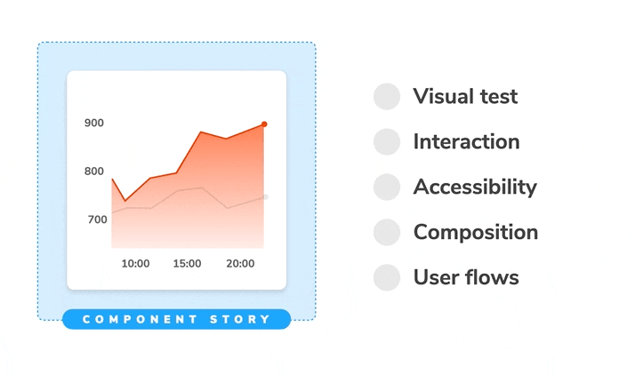

Storybook provides a clean-room environment for testing components in isolation. Stories make it easy to explore a component in all its variations, no matter how complex.

That means stories are a pragmatic starting point for your UI testing strategy. You already write stories as a natural part of UI development, testing those stories is a low-effort way to prevent UI bugs over time.

The simplest testing method is manual “spot checking”. You run Storybook locally, then eyeball every story to verify its appearance and behavior. [Publish](../workflows/publish-storybook.md) your Storybook online to share reproductions and get teammates involved.

Storybook also comes with tools, test runners, and handy integrations with the larger JavaScript ecosystem to expand your UI test coverage. These docs detail how you can use Storybook for UI testing.

- [**Visual tests**](./visual-testing.md) capture a screenshot of every story then compare it against baselines to detect appearance and integration issues
- [**Accessibility tests**](./accessibility-testing.md) catch usability issues related to visual, hearing, mobility, cognitive, speech, or neurological disabilities
- [**Interaction tests**](./interaction-testing.md) verify component functionality by simulating user behaviour, firing events, and ensuring that state is updated as expected
- [**Snapshot tests**](./snapshot-testing.md) detect changes in the rendered markup to surface rendering errors or warnings
- [**Import stories in other tests**](./importing-stories-in-tests.md) to QA even more UI characteristics
