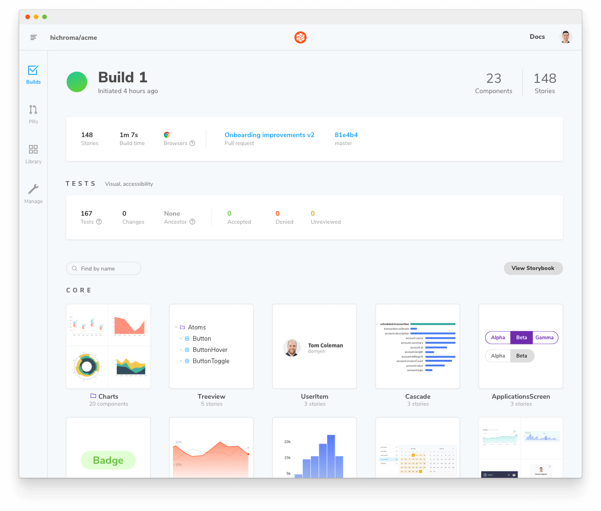
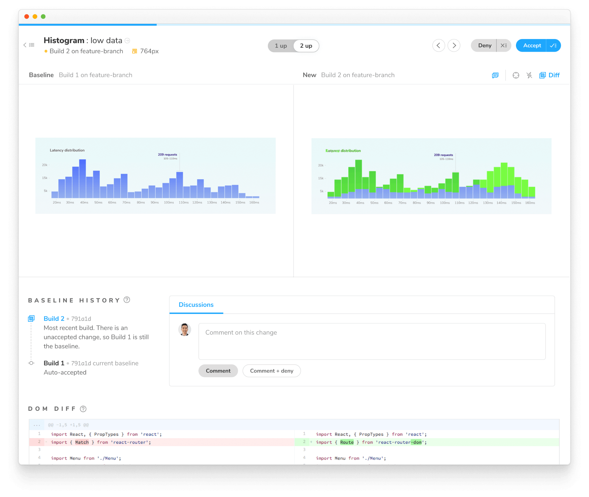

Visual tests, also called visual regression tests, catch bugs in UI appearance. They work by taking screenshots of every story and comparing them commit-to-commit to identify changes.

Ideal for verifying what the user sees: layout, color, size, and contrast. Storybook is a fantastic tool for visual testing because every story is essentially a test specification. Any time you write or update a story, you get a spec for free.


There are [many tools](https://github.com/mojoaxel/awesome-regression-testing) for visual testing. We recommend [Chromatic](https://www.chromatic.com) by Storybook maintainers to run visual tests in a lightning-fast cloud browser environment.

For a self-managed alternative to Chromatic, we offer [StoryShots](https://github.com/storybookjs/storybook/tree/master/addons/storyshots). It allows you to run visual tests on stories by integrating with [jest-image-snapshot](https://github.com/storybookjs/storybook/tree/master/addons/storyshots#configure-storyshots-for-image-snapshots).

## Setup Chromatic addon

Chromatic is a cloud service built for Storybook. It allows you to run visual tests with zero-config.

To get started, sign up with your [GitHub](https://github.com/), [GitLab](https://about.gitlab.com/), [Bitbucket](https://bitbucket.org/), or email and generate a unique `<project-token>` for your Storybook.

Next, install the [chromatic](https://www.npmjs.com/package/chromatic) CLI package from npm:

```shell
# With npm
npm install chromatic --save-dev

# With yarn
yarn add --dev chromatic
```

Run the following command after the package finishes installing:

```shell
npx chromatic --project-token <your-project-token>
```

<div class="aside">
 <strong>Note:</strong> Don't forget to replace <code>your-project-token</code> with the one provided by Chromatic.
</div>

```shell
Build 1 published.

View it online at https://www.chromatic.com/build?appId=...&number=1.
```

When Chromatic finishes, it should have successfully deployed your Storybook and established the baselines (i.e., starting point) for all your component's stories. Additionally, providing you with a link to the published Storybook that you can share with your team to gather feedback.



## Catching UI changes

Each time you run Chromatic, it will generate new snapshots and compare them against the existing baselines. That’s ideal for detecting UI changes and preventing potential UI regressions.

For example, let's assume you're working on a component and you tweak the styling. When Chromatic is re-run, it will highlight the difference between the baseline and the updated component.



If the changes are intentional, accept them as baselines. Otherwise, deny them to prevent UI regressions.

Learn how to [integrate Chromatic UI Tests](https://www.chromatic.com/docs/) into your CI pipeline.

---

#### What’s the difference between visual tests and snapshot tests?

Snapshot tests compare the rendered markup of every story against known baselines. This means the test compares blobs of HTML and not what the user actually sees. Which in turn, can lead to an increase in false positives as code changes don’t always yield visual changes in the component.

#### Learn about other UI tests

- Visual tests for appearance
- [Accessibility tests](./accessibility-testing.md) for accessibility
- [Interaction tests](./interaction-testing.md) for user behavior simulation
- [Snapshot tests](./snapshot-testing.md) for rendering errors and warnings
- [Import stories in other tests](./importing-stories-in-tests.md) for other tools
